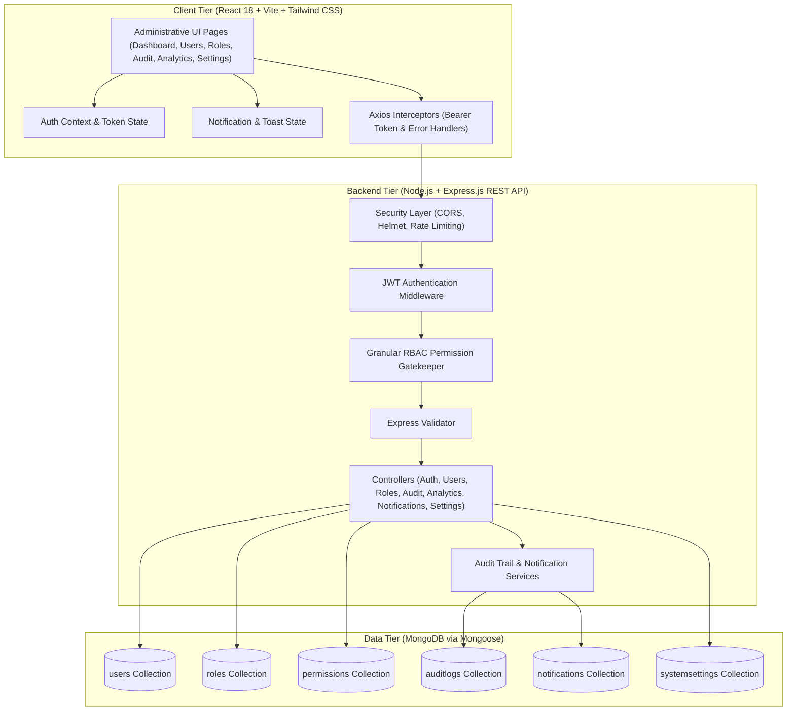

# AdminSphere — Enterprise Organization & Operations Management Platform

[-4F46E5.svg)](https://github.com)
[](LICENSE)
[]()
[]()

> **AdminSphere** is a centralized administrative and operations management platform designed for modern enterprises. It provides granular Role-Based Access Control (RBAC), live MongoDB telemetry, immutable forensic audit trails, user lifecycle management, self-service profile and password controls, broadcast notifications, and enterprise system configurations.

---

## 1. Executive Summary & Problem Statement

Modern growing organizations often struggle with fragmented administrative tooling, insecure permission boundaries, and zero accountability for configuration changes. Standard CRUD tools fail to protect critical data, lack non-repudiable audit logging, and hardcode simplistic authorization checks solely on the frontend.

**AdminSphere** solves these enterprise operational challenges through:
- **Zero-Trust Backend RBAC:** Route-level, method-level, and permission-level authorization guarantees that no client can bypass access boundaries.
- **Forensic Audit Logging:** Every sign-in, account creation, privilege adjustment, activation status toggle, and system configuration change is recorded in an immutable MongoDB collection with client IP and user-agent metadata.
- **Live Database Aggregation:** Real-time metrics compute active user ratios, monthly onboarding trends, role distributions, and authentication density directly from MongoDB via Mongoose aggregation pipelines.
- **Enterprise UX Design:** Built with React 18, Vite, and Tailwind CSS, featuring a responsive dual-drawer layout, debounced search, granular multi-filter selectors, destructive action dialogs, and instant toast feedback.

---

## 2. Technology Stack

### Frontend Architecture
- **Framework:** [React 18](https://react.dev/) + [Vite](https://vitejs.dev/) (lightning-fast HMR and optimized Rollup bundling)
- **Styling & UI:** [Tailwind CSS](https://tailwindcss.com/) (modern SaaS dark/light slate palette, custom scrollbars, typography)
- **Icons:** [Lucide React](https://lucide.dev/) (consistent, accessible administrative icon set)
- **Data Visualization:** [Recharts](https://recharts.org/) (declarative SVG charts: Area, Bar, and Pie charts)
- **Routing:** [React Router v6](https://reactrouter.com/) (nested administrative shell, protected routes, permission gates)
- **HTTP Client:** [Axios](https://axios-http.com/) (request/response interceptors for Bearer JWT injection, 401 handling, and error normalization)

### Backend Architecture
- **Runtime:** [Node.js](https://nodejs.org/) (v20+ LTS)
- **Framework:** [Express.js](https://expressjs.com/) (modular routing, controllers, services, middleware)
- **Database & ODM:** [MongoDB](https://www.mongodb.com/) via [Mongoose](https://mongoosejs.com/)
- **Security:** [bcryptjs](https://github.com/dcodeIO/bcrypt.js) (salted password hashing, cost factor 10), [jsonwebtoken (JWT)](https://jwt.io/), [Helmet](https://helmetjs.github.io/), and [CORS](https://expressjs.com/en/resources/middleware/cors.html)
- **Input Validation:** [express-validator](https://express-validator.github.io/docs/)
- **Local Resilience:** Integrated `mongodb-memory-server` fallback for zero-configuration testing when standalone MongoDB daemons are not running.

---

## 3. System Architecture & Information Flow



---

## 4. Repository & Project Structure

```
AdminSphere/
├── package.json                   # Root package orchestration scripts
├── README.md                      # Comprehensive technical documentation
├── server/                        # Express Backend REST API
│   ├── package.json
│   ├── .env.example
│   ├── .env                       # Environment variables
│   └── src/
│       ├── config/
│       │   ├── db.js              # Resilient Mongoose connection + memory fallback
│       │   └── constants.js       # System roles, permission keys, and audit actions
│       ├── models/
│       │   ├── User.js            # User model (bcrypt hook, indexes, role ref)
│       │   ├── Role.js            # Role model (name, description, permissions)
│       │   ├── Permission.js      # Permissions master catalog
│       │   ├── AuditLog.js        # Audit trail documents with metadata diffs
│       │   ├── Notification.js    # System alerts & broadcast notifications
│       │   └── SystemSetting.js   # Organization, security, and notification settings
│       ├── middleware/
│       │   ├── auth.js            # JWT verification & session freshness check
│       │   ├── rbac.js            # Role and granular permission check middleware
│       │   └── errorHandler.js    # Standardized JSON error response handler
│       ├── controllers/
│       │   ├── authController.js
│       │   ├── userController.js
│       │   ├── roleController.js
│       │   ├── dashboardController.js
│       │   ├── auditController.js
│       │   ├── notificationController.js
│       │   ├── analyticsController.js
│       │   ├── profileController.js
│       │   └── settingsController.js
│       ├── routes/
│       │   ├── index.js           # API v1 router index
│       │   ├── authRoutes.js
│       │   ├── userRoutes.js
│       │   ├── roleRoutes.js
│       │   ├── dashboardRoutes.js
│       │   ├── auditRoutes.js
│       │   ├── notificationRoutes.js
│       │   ├── analyticsRoutes.js
│       │   ├── profileRoutes.js
│       │   └── settingsRoutes.js
│       ├── services/
│       │   ├── auditService.js    # Non-blocking event-driven audit recording
│       │   └── notificationService.js
│       ├── validators/
│       │   ├── authValidators.js
│       │   └── userValidators.js
│       ├── scripts/
│       │   ├── seed.js            # Database seeding script with realistic data
│       │   └── verify-api.js      # 21-test automated E2E verification suite
│       ├── app.js                 # Express application configuration
│       └── server.js              # Server entry point & auto-bootstrap logic
└── client/                        # React 18 + Vite Frontend
    ├── index.html
    ├── package.json
    ├── vite.config.js             # Vite config with proxy & preserveSymlinks
    ├── tailwind.config.js         # Custom enterprise palette
    ├── postcss.config.js
    └── src/
        ├── components/
        │   ├── common/            # Modal, ConfirmDialog, Pagination
        │   ├── feedback/          # ToastContainer, LoadingSpinner, EmptyState
        │   └── navigation/        # Sidebar, TopNavbar
        ├── context/
        │   ├── AuthContext.jsx    # Session state & permission evaluator
        │   └── NotificationContext.jsx # Toast dispatcher & notification poller
        ├── layouts/
        │   └── DashboardLayout.jsx# Administrative responsive shell
        ├── pages/
        │   ├── auth/Login.jsx     # Modern split-screen login + 1-click role switcher
        │   ├── dashboard/Dashboard.jsx # Live KPIs, Recharts charts, activity feed
        │   ├── users/UserList.jsx # User management, filters, modal, status toggle
        │   ├── users/UserDetail.jsx # User profile, attributes, user audit history
        │   ├── roles/RoleManagement.jsx # Role hierarchy & permission toggles
        │   ├── audit/AuditLogs.jsx# Audit log viewer with filters & JSON inspector
        │   ├── analytics/Analytics.jsx # Velocity & density visualizations
        │   ├── notifications/NotificationCenter.jsx # Live notifications
        │   ├── profile/ProfileSettings.jsx # Self-service details & password change
        │   └── settings/SystemSettings.jsx # General, security & notification settings
        ├── routes/
        │   ├── AppRoutes.jsx      # Route definitions
        │   └── ProtectedRoute.jsx # Route-level RBAC & authentication protection
        ├── services/
        │   └── api.js             # Configured Axios client with interceptors
        └── utils/
            ├── formatters.js      # Date, time-ago, and status badge helpers
            └── permissions.js     # Permission catalog & evaluator helpers
```

---

## 5. Role-Based Access Control (RBAC) Specification

AdminSphere implements a 4-tier hierarchical access structure backed by 9 granular permissions:

| Permission Key | Description | Super Admin | Admin | Manager | User |
| :--- | :--- | :---: | :---: | :---: | :---: |
| `users.view` | View user directory, profiles, and basic activity | :white_check_mark: | :white_check_mark: | :white_check_mark: | :white_check_mark: |
| `users.create` | Provision new user accounts | :white_check_mark: | :white_check_mark: | :white_check_mark: | :x: |
| `users.update` | Modify user attributes, roles, and status | :white_check_mark: | :white_check_mark: | :white_check_mark: | :x: |
| `users.delete` | Permanently remove accounts from the directory | :white_check_mark: | :x: | :x: | :x: |
| `roles.manage` | Create custom roles and reconfigure permission matrices | :white_check_mark: | :x: | :x: | :x: |
| `reports.view` | Access organizational telemetry and analytics charts | :white_check_mark: | :white_check_mark: | :white_check_mark: | :x: |
| `audit.view` | Inspect forensic security logs and metadata payloads | :white_check_mark: | :white_check_mark: | :x: | :x: |
| `notifications.manage` | Broadcast and clear organization-wide alerts | :white_check_mark: | :white_check_mark: | :white_check_mark: | :x: |
| `settings.manage` | Alter security policies, MFA rules, and general config | :white_check_mark: | :white_check_mark: | :x: | :x: |

---

## 6. Pre-Configured Test Credentials

For evaluation and testing, the application includes 4 pre-configured role tiers with realistic seed data:

| Role | Email Address | Password | Privileges Summary |
| :--- | :--- | :--- | :--- |
| **Super Admin** | `superadmin@adminsphere.io` | `Admin@123456` | Complete unrestricted platform authority (all permissions). |
| **Admin** | `admin@adminsphere.io` | `Admin@123456` | User, audit, reports, notifications, and settings management. |
| **Manager** | `manager@adminsphere.io` | `Manager@123456` | Departmental oversight, team creation/updates, and reports view. |
| **Standard User** | `user@adminsphere.io` | `User@123456` | Self-service profile, read-only directory lookup. |

> **Quick Login Tip:** On the Login page (`/login`), click any role badge under the **Quick Demo Role Switcher** to auto-fill the credentials in 1 click.

---

## 7. Installation & Setup Guide

### Prerequisites
- Node.js `v18.0.0` or higher (Tested on `v20.17.0`)
- npm `v9.0.0` or higher (Tested on `10.8.2`)
- *(Optional)* Local MongoDB instance or MongoDB Atlas URI (The application automatically boots an embedded MongoDB memory engine if no local daemon is running, guaranteeing zero-friction local testing).

### Step 1: Clone Repository & Install Dependencies
```bash
# Clone the repository
git clone https://github.com/organization/adminsphere.git
cd adminsphere

# Install root dependencies
npm install

# Install server dependencies
cd server
npm install

# Install client dependencies
cd ../client
npm install
cd ..
```

### Step 2: Environment Configuration
The backend is pre-configured with safe development defaults in `server/.env`. You can modify it or copy from `.env.example`:
```env
PORT=5000
NODE_ENV=development
MONGODB_URI=mongodb://localhost:27017/adminsphere
JWT_SECRET=adminsphere_super_secure_jwt_secret_key_2026_x89f
JWT_EXPIRES_IN=7d
CLIENT_URL=http://localhost:5173
```

### Step 3: Seed Database
Populate the database with demo accounts, roles, historical audit logs, and system settings:
```bash
cd server
npm run seed
```

---

## 8. Running the Application

### Development Mode (Concurrent)
You can start both server and client with independent terminal windows or using npm scripts:

**Terminal 1 — Backend REST API:**
```bash
cd server
npm run dev
# Running on http://localhost:5000 (API at http://localhost:5000/api/v1)
```

**Terminal 2 — Frontend Client:**
```bash
cd client
npm run dev
# Running on http://localhost:5173
```

Open your browser to `http://localhost:5173` to access AdminSphere.

---

## 9. Verification & Automated Test Suite

AdminSphere includes a dedicated 21-point automated end-to-end API and RBAC verification test suite that boots the server, verifies database connectivity, tests authentication, checks authorization rejections, runs CRUD operations, and validates audit logging.

To run the verification suite:
```bash
cd server
npm run test:api
```

### Verification Test Summary Output:
```
=============================================================
--- ADMINSPHERE COMPREHENSIVE E2E VERIFICATION SUITE ---
=============================================================

[PASS] Health Check Endpoint /api/v1/health
[PASS] Invalid Credentials Rejection (401)
[PASS] Super Admin Authentication & JWT Generation
[PASS] Standard User Authentication (user@adminsphere.io)
[PASS] Verify Current User (/auth/me)
[PASS] Protected Route Blocked for Unauthenticated Request (401)
[PASS] Dashboard Aggregated KPIs and Activity Feed from MongoDB
[PASS] User Management Directory with Pagination & Active Filter
[PASS] RBAC Enforcement: Standard User Denied users.create Operation (403 Forbidden)
[PASS] Admin User Creation with Password Hashing
[PASS] User Detail Lookup with Role Population (/api/v1/users/:id)
[PASS] User Profile Update (/api/v1/users/:id)
[PASS] User Status Toggle (Deactivation / Reactivation)
[PASS] User Account Deletion (/api/v1/users/:id)
[PASS] Roles & Permissions Master Hierarchy Matrix
[PASS] Audit Logging Engine Recording Operational Events in MongoDB
[PASS] Notification Center & Unread Count Aggregation
[PASS] Mark All Notifications As Read
[PASS] Enterprise Analytics & Visual Reporting Aggregates
[PASS] System Settings Fetch by Category
[PASS] System Settings Update & Persistence

=============================================================
--- TEST RESULTS: 21 PASSED | 0 FAILED ---
=============================================================
>> ALL BACKEND APIS & SECURITY POLICIES FUNCTIONING FLAWLESSLY! <<
```

### Verifying Frontend Production Build:
```bash
cd client
npm run build
# Compiles clean production bundle in client/dist without errors.
```

---

## 10. REST API Specification

All API endpoints are prefixed with `/api/v1`:

### Authentication (`/api/v1/auth`)
| Method | Endpoint | Access | Description |
| :--- | :--- | :--- | :--- |
| `POST` | `/auth/login` | Public | Authenticate user with email and password, returns JWT token. |
| `GET` | `/auth/me` | Authenticated | Retrieve profile and permissions of the currently signed-in user. |
| `POST` | `/auth/logout` | Authenticated | Record audit logout event and invalidate local session. |

### User Management (`/api/v1/users`)
| Method | Endpoint | Permission | Description |
| :--- | :--- | :--- | :--- |
| `GET` | `/users` | `users.view` | List users with pagination (`page`, `limit`), `search`, `role`, and `status`. |
| `GET` | `/users/:id` | `users.view` | Get user details and recent audit logs associated with this user. |
| `POST` | `/users` | `users.create` | Create a new user with bcrypt password hashing and validation. |
| `PUT` | `/users/:id` | `users.update` | Update user details, role assignment, and department. |
| `PATCH` | `/users/:id/status` | `users.update` | Toggle user status between `active`, `inactive`, and `suspended`. |
| `DELETE` | `/users/:id` | `users.delete` | Permanently remove a user account. |

### Role Management (`/api/v1/roles`)
| Method | Endpoint | Permission | Description |
| :--- | :--- | :--- | :--- |
| `GET` | `/roles` | Authenticated | List all organizational roles with user headcount and assigned permissions. |
| `GET` | `/roles/permissions` | `roles.manage` | List master permissions catalog grouped by module. |
| `POST` | `/roles` | `roles.manage` | Create a new custom role with specific permission assignments. |
| `PUT` | `/roles/:id` | `roles.manage` | Update role permissions and description. |

### Dashboard & Analytics (`/api/v1/dashboard`, `/api/v1/analytics`)
| Method | Endpoint | Permission | Description |
| :--- | :--- | :--- | :--- |
| `GET` | `/dashboard/stats` | Authenticated | Aggregated KPI counters, role breakdown, and recent activity stream. |
| `GET` | `/analytics` | `reports.view` | 12-month registration velocity, 14-day login density, and department counts. |

### Audit Logging (`/api/v1/audit`)
| Method | Endpoint | Permission | Description |
| :--- | :--- | :--- | :--- |
| `GET` | `/audit` | `audit.view` | Query forensic audit logs with `action`, `actorEmail`, date range, and pagination. |

### Notification Center (`/api/v1/notifications`)
| Method | Endpoint | Access | Description |
| :--- | :--- | :--- | :--- |
| `GET` | `/notifications` | Authenticated | Retrieve direct and broadcast notifications with unread count. |
| `PATCH` | `/notifications/:id/read` | Authenticated | Mark an individual notification as read. |
| `POST` | `/notifications/mark-all-read` | Authenticated | Mark all notifications as read for current user. |
| `DELETE` | `/notifications/:id` | Authenticated | Clear an individual notification. |

### Profile & Security Settings (`/api/v1/profile`, `/api/v1/settings`)
| Method | Endpoint | Permission | Description |
| :--- | :--- | :--- | :--- |
| `GET` | `/profile` | Authenticated | Fetch current user profile information. |
| `PUT` | `/profile` | Authenticated | Update user name, department, and phone. |
| `POST` | `/profile/change-password` | Authenticated | Verify current password and update to new password. |
| `GET` | `/settings` | `settings.manage` | Get organization system settings (general, security, notifications). |
| `PUT` | `/settings` | `settings.manage` | Update system settings in bulk with audit record. |

---

## 11. Security Best Practices Implemented

1. **Password Protection:** Plain-text passwords are never stored. Passwords are salted and hashed using `bcryptjs` with cost factor 10. `User` schema specifies `select: false` on password fields to prevent accidental serialization.
2. **Stateless JWTs:** Tokens include standard expirations (`7d`), signed using server-side HMAC secrets.
3. **Layered Authorization:** All sensitive operations verify permissions on the Express backend middleware before reaching database controllers.
4. **Header Hardening:** Express utilizes `helmet()` to set secure HTTP headers (XSS Filter, frameguard, HSTS).
5. **No Exposure of Stack Traces:** Centralized error handling returns clean JSON responses in production without leaking internal database stacks.

---

## 12. License
AdminSphere is open-source software licensed under the [MIT License](LICENSE).
